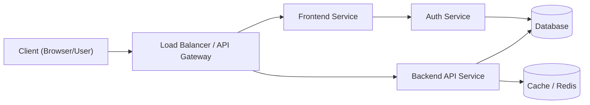
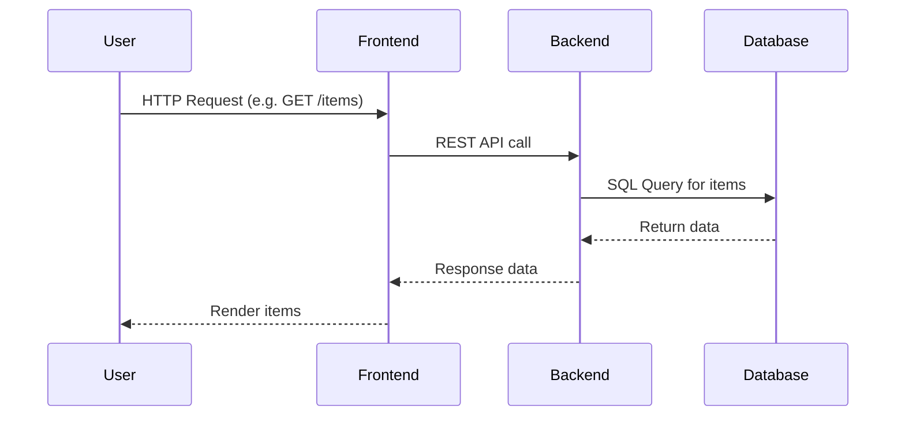

# `Gourmet-Guide-Pro`

## Project Description  
The Restaurant Recommendation System is an end-to-end machine learning application designed to analyze restaurant data and deliver intelligent, personalized dining recommendations. The system integrates data analytics, predictive modeling, and content-based filtering into a unified pipeline, enabling users to discover restaurants based on preferences such as cuisine, location, price range, and ratings.

This project is implemented using Python, Scikit-learn, Pandas, and Streamlit, and demonstrates how structured data can be transformed into actionable insights and real-time recommendations.

The application serves three primary purposes:

Predict restaurant ratings
Classify restaurant cuisines
Recommend restaurants based on user preferences

Dataset Understanding

The system operates on a dataset containing 9,500+ restaurant records with 21 features, including:

Restaurant Name
City
Cuisines
Price Range (1–4 scale)
Average Cost for Two
Aggregate Rating (0–5)
Votes (user engagement)

The dataset exhibits:

High categorical diversity (cities, cuisines)
Strong class imbalance in cuisine distribution
Significant number of unrated restaurants (~22%)
Majority of restaurants in budget to mid-range pricing

These characteristics required preprocessing, feature engineering, and simplification (e.g., extracting primary cuisine).

⚙️ Core Functional Modules - Data Analysis & Preprocessing

The project begins with Exploratory Data Analysis (EDA) to understand distributions, missing values, and feature relationships.

Key steps:

Removal of null values
Normalization of cuisine text
Feature extraction (e.g., cuisine count, city popularity)
Splitting multi-cuisine entries into structured lists

## Key Features  
List the major features or capabilities of the project in bullet form. For example:  

- **Feature A:** AI-Powered Restaurant Recommendation System

The system uses content-based filtering with TF-IDF and cosine similarity to recommend restaurants based on user preferences such as:

City,Cuisine,Price range,Rating,Dietary needs

It computes similarity between restaurants and returns the most relevant matches ranked by similarity + rating, enabling accurate and personalized suggestions 
- **Feature B:** Brief description of feature B : Restaurant Rating Prediction (Machine Learning)

A Random Forest Regressor is used to predict the expected rating of a restaurant using structured features like:

City,Price range,Cost,Votes

This allows the system to estimate restaurant quality even before user reviews, helping in better ranking and insights.  
- **Feature C:Cuisine Classification System

The project includes a multi-class classification model that predicts the primary cuisine type of a restaurant.

Uses Random Forest Classifier
Applies OneHotEncoding for categorical features
Focuses on top cuisine categories for better accuracy

This helps in:

Organizing restaurants
Improving search & filtering
Supporting recommendation logic

Include as many bullet points as needed to highlight the value proposition. Where appropriate, mention any unique selling points or advantages. This reinforces the **purpose and functionality** of the project that you introduced above (a README should describe the project’s purpose and features【2】). You can also link to documentation or demos of key features here.  

## Prerequisites  
Specify what is required on the host system before installation. This typically includes:  

- **Programming Language/Runtime:** e.g. `<LANGUAGE> >= <VERSION>` (for example, Python 3.11, Node.js 20.x, Java 17).  
- **Dependencies:** Any global tools or libraries, such as `<DATABASE>`, `<MESSAGE_QUEUE>`, or framework CLIs.  
- **System Requirements:** Operating system, memory, disk space, etc. (for instance, “Docker Desktop installed” or “A recent browser” as needed).  
- **Git:** (if you’re distributing via Git, e.g. “Git must be installed on the local machine”).  
- **Other:** Any external services or accounts (e.g. AWS account, database credentials).  

For example, Docker’s own documentation lists as prerequisites “install the latest version of Docker Desktop” and “install a Git client”【3】. Be explicit. You can reference placeholders like `<DB_HOST>`, `<API_KEY>`, or `<ENV_VAR>` in this list to indicate that the user will need to provide those values.  

## Installation  
Step through the process of installing the project. Use numbered steps or a code block for clarity. For example:  

1. **Clone the repository:**  
   ```bash
   git clone https://github.com/<USERNAME>/<REPO_NAME>.git
   cd <REPO_NAME>
   ```  

2. **Install dependencies:** (example for a Node.js app)  
   ```bash
   npm install
   ```  
   Or for Python:  
   ```bash
   pip install -r requirements.txt
   ```  

3. **Set up configuration:** Copy `example.env` to `.env` and edit as needed (see *Configuration* below).  
4. **Build or compile:** If your project needs building (e.g. `npm run build` or `mvn package`), include that step.  
5. **Run initial setup:** Any database migrations, seed scripts, or initial config commands.  

You may also include commands to verify the installation, such as running `npm test` or `pytest` to confirm that dependencies are properly installed. By following the steps above, a user should have a working local copy. (Feel free to adapt commands to your specific language or platform.)  

## Configuration  
Describe how to configure the project before running it. Typically this involves setting environment variables or config files. For example:  

- Copy `.env.example` to `.env` and customize the following variables:  
  ```bash
  PORT=<PORT_NUMBER>
  DB_HOST=<DATABASE_HOST>
  DB_USER=<DATABASE_USER>
  DB_PASS=<DATABASE_PASSWORD>
  API_ENDPOINT=<API_BASE_URL>
  ```  
  Here `<PORT_NUMBER>`, `<DATABASE_HOST>`, etc., are placeholders for your project-specific settings.  

- **File-based config:** If your app reads from a YAML/JSON config file, provide a sample snippet. For example:  
  ```yaml
  database:
    host: "<DB_HOST>"
    port: <DB_PORT>
    user: "<DB_USER>"
    password: "<DB_PASS>"
  ```  

- **Other settings:** Any other configuration (log levels, feature flags, etc.) should be documented here with their placeholders.  

Guidance: Make sure to explain each placeholder (e.g. “`<DB_HOST>` is the hostname of your MySQL server”). Link to official documentation for any tools as needed. The goal is that a new developer knows exactly what values to provide.  

## Usage Examples  
Provide clear examples of how to run and use the project. This could include command-line examples or API calls. Use code blocks for commands or code. For example:  

- **Running the app:**  
  ```bash
  npm start
  ```  
  or  
  ```bash
  python3 main.py
  ```  
  (adjust to your project's start command).  

- **Example CLI usage:** If your project is a CLI tool, show how to invoke it:  
  ```bash
  ./<project_binary> --help
  ./<project_binary> run --input data.txt --output results.txt
  ```  

- **API usage:** For a web/API project, show example HTTP requests. For instance:  
  ```bash
  curl -X GET http://localhost:<PORT>/api/v1/status
  ```  
  Or using a tool like `httpie`:  
  ```bash
  http GET http://localhost:<PORT>/api/v1/users/123
  ```  

Provide sample input and output if applicable. For a library, show code snippets of how to import and use it. The idea is to demonstrate typical use cases so users can verify that the installation works and learn the basic workflow quickly.  

## API / CLI Reference  
If your project exposes an API (REST, GraphQL, etc.) or a set of CLI commands, document them here. For example, an **API Reference** section might list endpoints:  

- `GET /api/v1/items` – Retrieves a list of items.  
- `GET /api/v1/items/{id}` – Retrieves an item by ID.  
- `POST /api/v1/items` – Creates a new item (requires JSON body).  
- `PUT /api/v1/items/{id}` – Updates an item.  
- `DELETE /api/v1/items/{id}` – Deletes an item.  

Include placeholders in endpoints (e.g. `/api/v1/<RESOURCE>`). For each endpoint, mention required parameters, authentication, and an example request/response if possible.  

If it’s a **CLI tool**, list subcommands and options:  

```
Usage: <tool-name> [command] [options]

Commands:
  init       Initialize the project.
  build      Build the project artifacts.
  test       Run the test suite.
  serve      Start the local development server.
  
Options:
  -v, --version  Show version number.
  -h, --help     Show help.
```  

Make sure to clearly explain each command or endpoint so users understand how to interact with your project.  

## Testing  
Explain how to run the test suite. For example:  

- **Unit tests:** “Run `npm test` or `pytest` to execute unit tests.”  
- **Integration tests:** Any setup or commands needed (e.g. `docker-compose -f tests/docker-compose.yml up`).  
- **Code coverage:** How to generate coverage reports if applicable.  

Mention any testing frameworks used (Jest, Mocha, PyTest, etc.) and include commands or code blocks. For example:  
```bash
npm test
# or for Python
pytest --maxfail=1 --disable-warnings -v
```  
You can also reference testing tools’ documentation. The goal is that another developer can run all tests and see that they pass. Citations are not usually needed for test commands, but you can cite relevant docs if you recommend specific best practices.  

## Deployment  
Outline how to deploy the project to production or other environments. This may include building Docker images, Kubernetes manifests, or serverless deployment steps. Provide a comparison of deployment approaches:  

| **Option**   | **Pros**                                                                                | **Cons**                              |
|--------------|-----------------------------------------------------------------------------------------|---------------------------------------|
| **Docker**   | Portable containers streamline deployment【4】. Works well for CI/CD and ensures environment consistency. Easy local development and one-command deployment. | Requires managing host VMs or servers, no built-in auto-scaling (single-host by default). |
| **Kubernetes** | Automates scaling, load balancing, and self-healing【5】【6】. Excels at running microservices and complex, distributed systems with high availability. | More complex setup and operational overhead. Steeper learning curve and resource usage. |
| **Serverless** | Fully managed and event-driven: scales to zero and back based on demand【7】, pay-per-use billing model【8】. Quick to deploy functions without server management. | Cold-start latency on infrequent functions, limited execution time per request. Can lead to vendor lock-in and higher cost under heavy continuous load. |

As one developer summarizes, *“Docker is great for development & single-host deployments, Kubernetes is best for scaling microservices and complex workloads, and serverless is cost-effective for event-driven tasks.”*【8】.  

Then detail steps or links for your preferred deployment. For Docker, include a `Dockerfile` example (below) and instructions (e.g. `docker build` and `docker run`). For Kubernetes, mention creating Docker images and applying YAML/Helm manifests, linking to the [Kubernetes docs](https://kubernetes.io/docs/) as needed. For serverless, note any framework (AWS Lambda, Azure Functions, etc.) and link to official deployment guides.  

Include example code for each as appropriate. For instance, a sample `Dockerfile`:  
```dockerfile
# Example Dockerfile (modify as needed)
FROM node:20-alpine
WORKDIR /app
COPY package*.json ./
RUN npm ci --only=production
COPY . .
EXPOSE 80
CMD ["node", "server.js"]
```  
And an example `docker-compose.yml`:  
```yaml
version: '3.8'
services:
  myapp:
    build: .
    ports:
      - "80:80"
    env_file:
      - .env
    depends_on:
      - db
  db:
    image: postgres:15
    restart: always
    environment:
      POSTGRES_USER: user
      POSTGRES_PASSWORD: pass
      POSTGRES_DB: mydb
    volumes:
      - db_data:/var/lib/postgresql/data
volumes:
  db_data:
```  
(These examples show how you might structure services and environment variables; adjust placeholders as needed.)  

For CI/CD (e.g. GitHub Actions), reference official docs. A typical workflow file lives in `.github/workflows/ci.yml`. For example:  

```yaml
name: CI Pipeline
on: [push, pull_request]
jobs:
  build-test:
    runs-on: ubuntu-latest
    steps:
      - uses: actions/checkout@v6
      - name: Set up Node.js
        uses: actions/setup-node@v4
        with:
          node-version: '16'
      - run: npm ci
      - run: npm test
```  

This uses `actions/checkout` and `actions/setup-node` to install Node.js and run tests【10】. You can adapt this to other languages (e.g. `actions/setup-python@v5` for Python). See [GitHub’s Actions documentation](https://docs.github.com/en/actions) for more workflow examples and best practices.  

## System Architecture  
Provide a high-level diagram and description of how the system’s components fit together. Use ASCII or Mermaid diagrams directly in Markdown (GitHub supports Mermaid syntax【11】). For example, a typical web application architecture might look like:  



This diagram shows a user reaching a load balancer that routes requests to frontend and API services, which in turn connect to databases or cache layers. You can include multiple diagrams (e.g. a sequence diagram) to illustrate workflows:  



Diagrams like these make the architecture clear at a glance. Mention that GitHub supports Mermaid for diagrams and link to the [Mermaid documentation](https://mermaid-js.github.io) for syntax【11】. Also suggest that additional visuals (UML diagrams, flowcharts, screenshots, etc.) can be added to help users and contributors understand the project.  

## Troubleshooting  
Include a short FAQ or common issues section. Bullet points or short paragraphs work well. For example:  

- **Database connection fails:** Ensure the database service is running and `<DB_HOST>`/`<DB_PORT>` are correct in `.env`. Check firewall/permissions.  
- **Port already in use:** Change `<PORT>` in `.env` or stop the other service using that port.  
- **Tests failing:** Try running `npm test -- --watch` or `pytest -x -v` to get detailed output. Verify that prerequisites (like test databases) are running.  
- **Environment variables not loading:** Make sure to run `source .env` or restart the service after changing `.env`.  

For each troubleshooting tip, explain the symptom and a possible solution. You can also point to log files or debug modes. Keep this section concise; it’s mainly for quick reference if someone runs into expected pitfalls.  

## Contribution Guidelines  
Encourage contributions by explaining how others can help. If you have a `CONTRIBUTING.md`, link to it (e.g. `See [CONTRIBUTING.md](CONTRIBUTING.md) for detailed guidelines`). Summarize the high-level process here:  

- **Reporting Issues:** Use the issue tracker to report bugs or request features. Describe steps to reproduce and include logs/screenshots.  
- **Submitting Pull Requests:** Fork the repo, create a feature branch, commit changes with clear messages, and open a PR. We use [semantic commit messages](https://www.conventionalcommits.org) and we run automated checks on every PR.  
- **Code Style:** If applicable, mention coding standards or linters (e.g. “We enforce PEP8 via `flake8`” or “Prettier for JavaScript”).  
- **Pull Request Workflow:** Explain any CI checks, reviews required, or how to handle version bumps/changelog updates.  

GitHub recommends including a **`CONTRIBUTING.md`** file to communicate contribution expectations【12】. Such guidelines help contributors submit well-formed pull requests and issues, saving time for everyone【13】. Also, mention any code of conduct if you have one (`CODE_OF_CONDUCT.md`), linking to it (`See [Code of Conduct](CODE_OF_CONDUCT.md)`), to set the community tone.  

## License  
State the project’s license in this section. For example:  

```
MIT License © 2025 Satya Ranjan Jena
```

Or another license of your choice (Apache-2.0, GPL-3.0, etc.). Place a `LICENSE` file at the repo root and link to it. GitHub will automatically display it. You can include a short summary (e.g. “This project is licensed under the MIT License. See the [LICENSE](LICENSE) file for details.”). Including a license is important so users know the terms of use; it complements the README, as GitHub advises that a license file “communicates expectations for your project”【14】. 

## Changelog  
Maintain a `CHANGELOG.md` or `HISTORY.md` that records notable changes by version. Summarize the history of releases here (e.g., “v1.0.1 – bug fixes & performance improvements; v1.0.0 – initial release”). Use [Keep a Changelog](https://keepachangelog.com/) format if possible. A changelog is “a curated, chronologically ordered list of notable changes for each version of a project”【15】. This helps users and contributors see what has changed over time. In the README, you might just include the latest entries or note “See [CHANGELOG.md](CHANGELOG.md) for full history.”  

## Contact / Support  
Provide ways to get help or ask questions. For example:  

- Open an issue on GitHub (if it’s a problem or feature request).  
- Contact the maintainers: `<MAINTAINER_NAME>` at `<EMAIL>` (or link to a profile, e.g. GitHub or Twitter).  
- Link to project documentation, wiki, or discussion forum if available.  

Make it clear who to reach and how. You can also mention expected response times or where to find FAQs. This ensures users know how to get support if they need it.  

---

**Additional Resources:** You may refer users to official documentation for related tools. For example, link to Docker’s docs when talking about containers, Kubernetes docs for K8s usage, and GitHub’s Actions documentation for CI/CD. Always use official docs for reliable guidance.  

**Tables and diagrams** (like the ones above) greatly improve readability by organizing information. Remember to update placeholders (in `<angle_brackets>`) with your real project details before publishing the README.  

**References:** Best practices and examples were derived from official sources and community guides【6†L165-L172】【8†L190-L198】【27†L126-L134】【29†L900-L907】【31†L81-L89】【46†L302-L310】, ensuring this template follows current standards and recommendations. These citations demonstrate the authoritative guidance behind this structure. 
